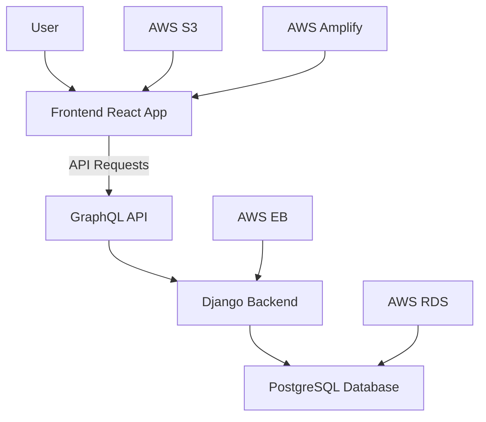

# vouch - A social feed for academic research

`vouch` is

```mermaid
graph TD
    A[User] --> B[Frontend React App]
    B -->|API Requests| C[GraphQL API]
    C --> D[Django Backend]
    D --> E[PostgreSQL Database]
    F[AWS S3] --> B
    G[AWS Amplify] --> B
    H[AWS RDS] --> E
    I[AWS EB] --> D
```